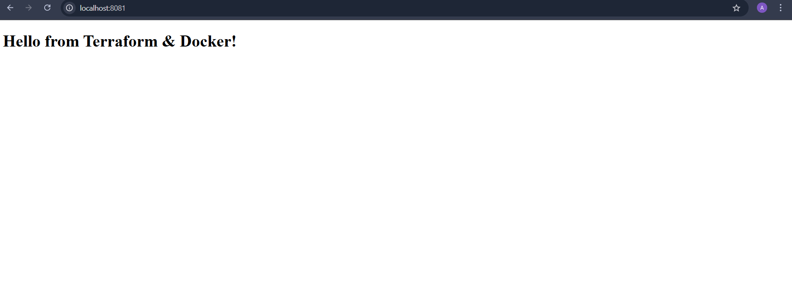
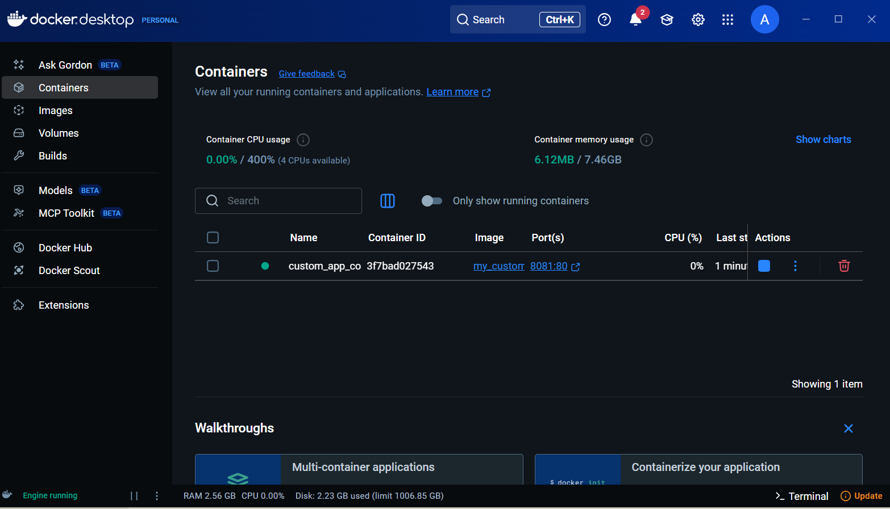
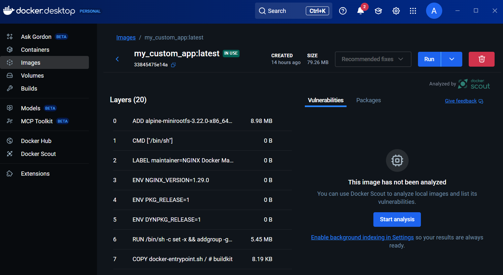

## 🚀 Build Your Own Docker Image with Terraform

This project demonstrates how to use Terraform to automate building and running a custom Docker container. Terraform provisions Docker resources including images and containers directly on your local machine.

---

## 📦 Features

- Uses the [Kreuzwerker/docker](https://registry.terraform.io/providers/kreuzwerker/docker/latest/docs) Terraform provider.
- Builds a custom Docker image from a local Dockerfile.
- Runs a container from the built image.
- Maps ports and auto-restarts on failure.

---

## 🛠️ Prerequisites

- [Terraform](https://www.terraform.io/downloads)
- [Docker](https://www.docker.com/get-started)

## 📦 Snapshots

